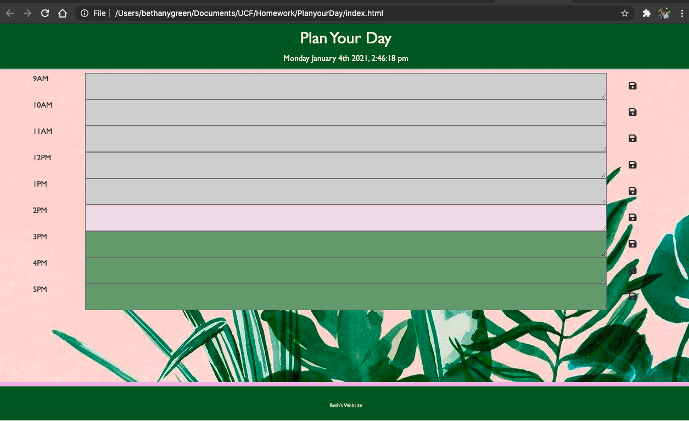

# PlanyourDay

Planner updates itself to current hour. 

User inputs what they need to accomplish for the day and planner saves in local storage. 

This is a day planner.

Simple planner that lets you record and save events at each hour of the day. 

Each timeblock is color coded to indicate whether it is in a past, present, or future hour.

GIVEN that an employee adds events to a specific hour in a calendar

WHEN the employee clicks the save button

THEN events are saved in the timeblock for that hour

link to application: 

screenshots of application:

